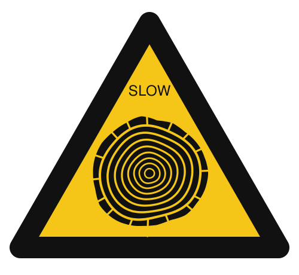

<p align="center"></p>

# Slow Money

**Intergenerational financial literacy, starting at the kitchen table.**

Slow Money is a series of documents and practices for families to understand money together, across the generations. It starts from a simple idea: before anyone opens a bank account, they have already learned what money means at home. Every family is an economy, whether it names itself one or not, and how that economy is run shapes everything else in family life.

The series takes its name and values from the Slow Food movement: money that is good, clean and fair, and the long view in place of the quick return.

## Where to start

- **New to Slow Money?** Read the [Manifesto](00-manifesto.md).
- **Have questions?** Read the [FAQ](01-faq.md).
- **Ready to try it?** Read the [Handbook](02-handbook.md), then hold your first [Kitchen Table](practices/kitchen-table.md).

## What's in this repository

```
slow-money/
├── README.md
├── 00-manifesto.md          why Slow Money
├── 01-faq.md                common questions and objections
├── 02-handbook.md           how to use the series
├── 03-glossary.md           plain-language terms
├── 04-roots.md              a short history of the family economy
│
├── ages/                    what each generation needs to understand
│   ├── children.md          about 6 to 11, read with an adult
│   ├── teenagers.md         about 12 to 17
│   ├── adults.md            parents, carers, households
│   └── elders.md            grandparents and the older generation
│
├── practices/               where the generations meet
│   ├── kitchen-table.md     the core family conversation
│   ├── money-memories.md    younger interviews older
│   ├── combined-wage.md     seeing what comes in, not only what goes out
│   ├── family-ledger.md     what to record, and what to leave as a gift
│   └── heirloom.md          choosing what to pass on
│
└── tools/
    └── literacy-test/       the Two Ledgers financial literacy test
```

The age tracks teach. The practices are where the ages meet. Every age track points to the practices where that age has a part to play.

## Three strands of Slow Money

This repository covers one strand of a wider idea.

- **Where money goes:** Woody Tasch's Slow Money movement, investing patiently in local food and place.
- **What money is:** Self-Mint and the Coin-tainer, money you can make, verify and hold yourself.
- **Where money is learned:** this series, the family as the first economy.

## Language

The series is written in English first. Italian versions will follow.

## Status

First drafts. All documents are open to revision.
